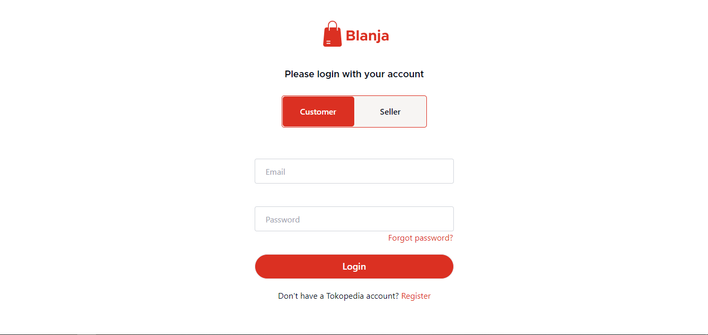
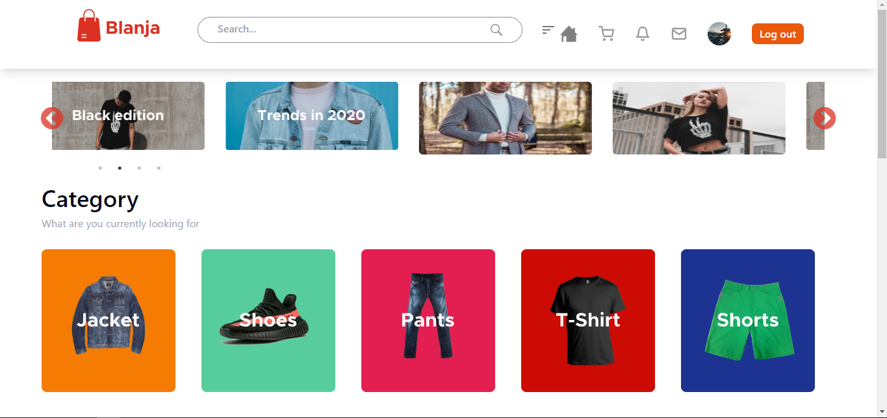
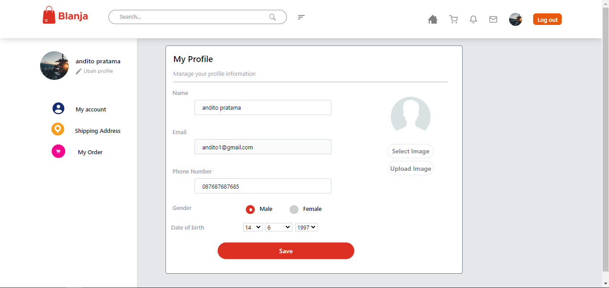
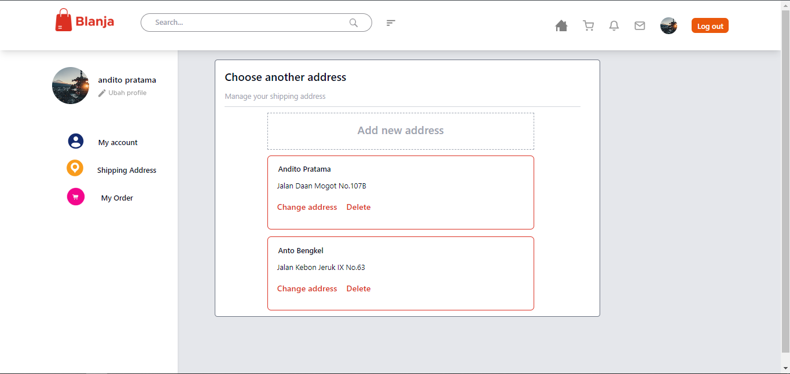
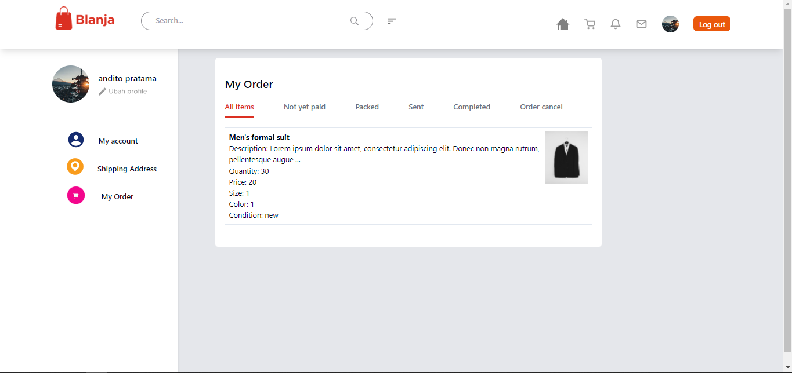
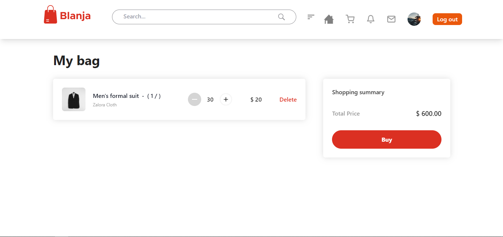
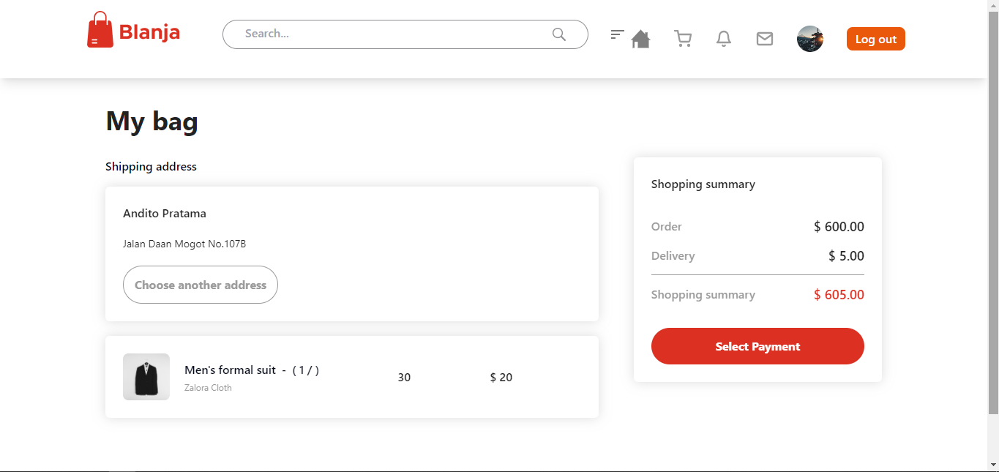

<p align="center">
  
</p>

<h1 align="center">
  <a href="https://git.io/typing-svg"></a>
</h1>

## Table of Contents

- [Introduction](#introduction)
- [Tech Stack](#Tech-Stack)
- [Features](#features)
- [Requirements](#requirements)
- [Instalation](#instalation)
- [Create Environment Variable](#create-environment-variable)
- [Screenshots](#screenshots)
- [Related Project](#related-project-backend)
- [Developed](#Developed-by-the-FWM19-Team)


## introduction

Welcome to Blanja, your premier destination for all things e-commerce. Blanja offers a seamless and secure online shopping experience, providing a wide range of products to cater to every need and preference.


## Tech Stack

**Programming language:** JavaScript (React JS)

**Framework:** Tailwind CSS

**Plugin:** React Icons, Slick Carousel, React Toastify

[](https://skillicons.dev)


## Features

✨ Users/Customers must log in if want to view & search the product
✨ Seller can add their products to sell to customers
✨ Users/Customers can add the products to their cart for later transaction
✨ Users/Customers can update their profile picture & profile bio
✨ Users/Customers can create their address, update address & delete address
✨ And etc


## Requirements

- [`npm`](https://www.npmjs.com/get-npm)
- [`react`](https://react.dev/learn/start-a-new-react-project)
- [`react-cli`](https://create-react-app.dev/docs/getting-started)
- [`Backend Blanja`](https://github.com/anditorp/blanja-be/tree/master)


## Instalation

#### Clone this repository

```bash
   git clone https://github.com/anditorp/blanja-fe.git
```

#### Install Depedencies

```bash
   npm install
```

#### Start Project

```bash
   npm run dev
```


## Create Environment Variable

If you want to run this environment, you need to add the following environment variables to your .env file

setup server: 

`VITE_URL_BLANJA`


## Screenshots

<div align="center">
       
       
</div>
<div align="center">
       
       
</div>
<div align="center">
        
        
       
</div>
<div align="center">
       
</div>


## Related Project (Backend)

- [`Backend Blanja`](https://github.com/anditorp/blanja-be.git)


## Developed by the FWM19 Team :

💻 [@anditorp](https://github.com/anditorp) as back end

💻 [@SwitchZer](https://github.com/SwitchZer) as back end

💻 [@crossxjonathan](https://github.com/crossxjonathan) as front end

💻 [@naufandarmawan](https://github.com/naufandarmawan) as front end